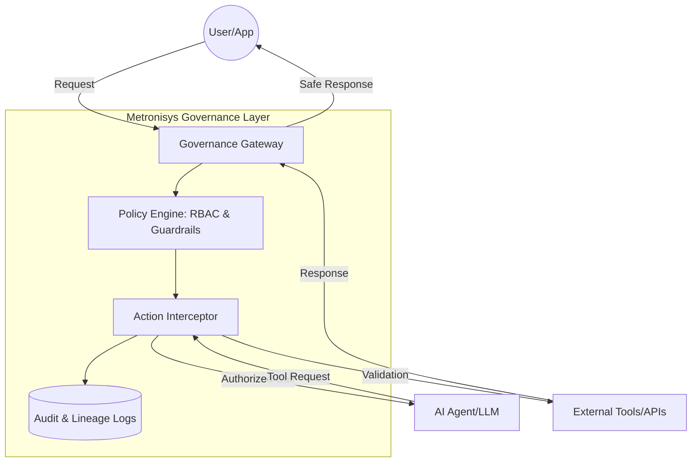

# Metronisys Agent Governance

**Metronisys Agent Governance: A standardized framework for secure, transparent, and compliant AI agent orchestration.**

---

## 💡 Overview

As AI agents transition from simple chatbots to autonomous entities with tool-access capabilities, the need for oversight becomes critical. The **Metronisys Agent Governance** framework provides a robust middleware layer designed to monitor, intercept, and audit AI agent behaviors in real-time.

This project implements the four pillars of agent oversight:
1.  **Identity:** Unique attribution for every agent instance.
2.  **Policy Enforcement:** Strict boundaries for tool usage and data access.
3.  **Real-time Auditing:** Comprehensive logging of the reasoning chain.
4.  **Lifecycle Management:** Controlled deployment and retirement of agentic workflows.

---

## 🛡️ Why Governance?

Unmanaged AI agents present significant operational and security risks. This framework is purpose-built to mitigate:

* **Prompt Injection:** Prevents malicious user inputs from hijacking the agent’s instructions or escalating privileges.
* **Data Exfiltration:** Monitors outbound tool calls to ensure sensitive data (PII/PHI) does not leave your secure perimeter.
* **Non-Deterministic Behavior:** Implements guardrails to ensure agents stay within their defined "operational envelope," reducing hallucinations and erratic tool usage.
* **Shadow AI:** Provides a centralized control plane so that every agent action is logged and attributable to a specific identity and policy version.

---

## 🏗️ Architecture

The framework acts as a **Governance Gateway** between the User, the LLM, and External Tools.

## Key Features

* ​Policy-as-Code:
Define agent permissions (tool access, data boundaries) in structured YAML/JSON configurations.
​Zero-Trust Identity: Every agent is assigned a unique cryptographic identity to ensure non-repudiation of actions.
​Unified Audit Trail: Centralized logging of reasoning chains, tool inputs, and outputs for forensic analysis.
​Safety Guardrails: Real-time scanning of inputs and outputs for restricted content or unauthorized commands.
​🛠️ Getting Started
​Prerequisites
​Python 3.9+
​OpenAI / Anthropic API Key (or local LLM endpoint)
​Installation

---

## License

This repository is licensed under the Apache License 2.0.

The license permits use, modification, and commercial embedding
of the governance materials contained herein.

---

## Trademark & Usage

**Metronisys™** is a trademark of John A. Nudd.  
Commercial use of the name requires permission.  
Open-source usage is permitted under the license of this repository.

---

Metronisys exists to ensure that as AI agents gain autonomy,  
**governance is embedded — not bolted on**.
