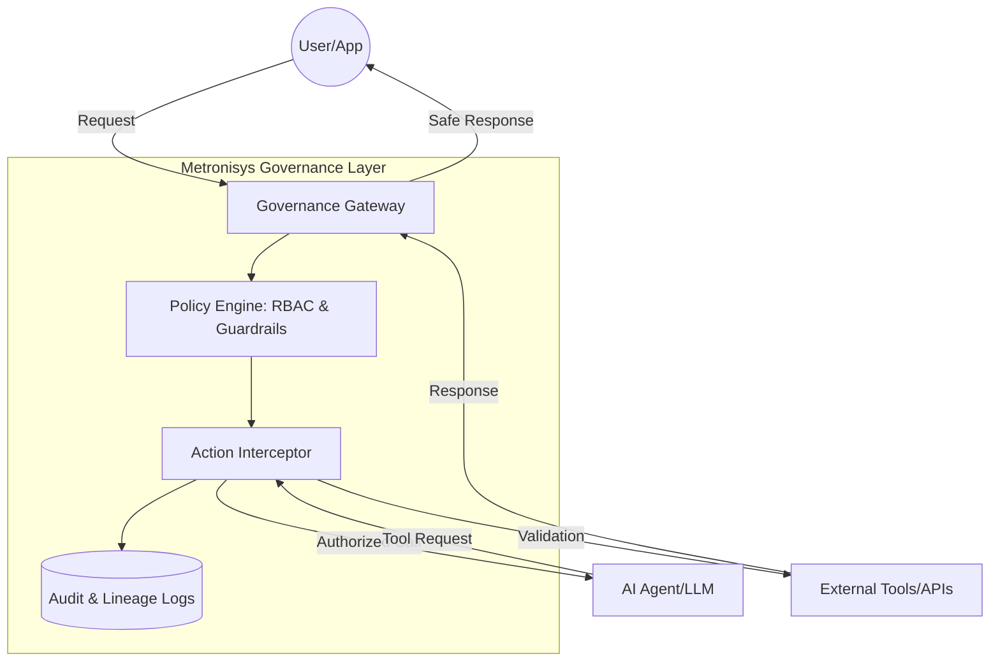

# Metronisys Agent Governance

**The industry standard for Human-First AI. A framework designed to ensure your AI agents follow your lead, treating human attention as a protected resource.**

---

## The Metronisys Philosophy
Unlike standard technical guardrails, Metronisys Governance is built on the principle that **AI should reduce mental load, not increase expectations.** Our framework ensures that as agents become more autonomous, they remain aligned with the core Metronisys human principles:

* **Attention Sovereignty:** Our "Human-in-the-Loop" gates are designed to protect your focus. Agents are governed to provide meaningful synthesis, not digital noise.

* **Energy-First Orchestration:** Governance policies prioritize agent actions that preserve human biological energy and prevent burnout caused by AI-accelerated output.

* **Intentional Autonomy:** We provide the technical constraints to ensure agents operate within purposeful limits, preventing "identity overload" and keeping the human in the driver's seat.

## Why Governance? (Human & Technical Risks)
We mitigate the critical failures that threaten both system security and human wellbeing:

* **Cognitive Overload:**
Prevents agents from over-communicating or requiring excessive manual verification.

* **Prompt Injection & Data Risks:**
Standard security guardrails to prevent unauthorized agent behavior.

* **Runaway Autonomy:**
Ensures agents cannot drift into "unowned workflows" that conflict with human intent or organizational values.



## Key Features

* ​**Policy-as-Code:**
Define agent permissions (tool access, data boundaries) in structured YAML/JSON configurations.

* **​Zero-Trust Identity:**
Every agent is assigned a unique cryptographic identity to ensure non-repudiation of actions.

* **​Unified Audit Trail:**
Centralized logging of reasoning chains, tool inputs, and outputs for forensic analysis.

* **​Safety Guardrails:**
Real-time scanning of inputs and outputs for restricted content or unauthorized commands.

## ​Getting Started

**​Prerequisites**

​Python 3.9+
​OpenAI / Anthropic API Key (or local LLM endpoint) ​Installation

```
git clone [https://github.com/metronisys/agent-governance.git](https://github.com/metronisys/agent-governance.git)
cd agent-governance
pip install -r requirements.txt
```

**Quick Start**

Configure your governance policies in configs/governance_policy.yaml and wrap your agent:

```
from metronisys.governance
import GovernanceGateway

# Initialize the governance layer
governance = GovernanceGateway(policy_path="configs/default_policy.yaml")

# Wrap your agent logic
response = governance.execute(agent_input="Analyze Q4 financial trends")
print(response)
```
---

## License

This repository is licensed under the Apache License 2.0.

The license permits use, modification, and commercial embedding of the governance materials contained herein.

---

## Trademark & Usage

**Metronisys™** is a trademark of John A. Nudd.  
Commercial use of the name requires permission.  
Open-source usage is permitted under the license of this repository.

---

Metronisys exists to ensure that as AI agents gain autonomy,  
**governance is embedded — not bolted on**.
